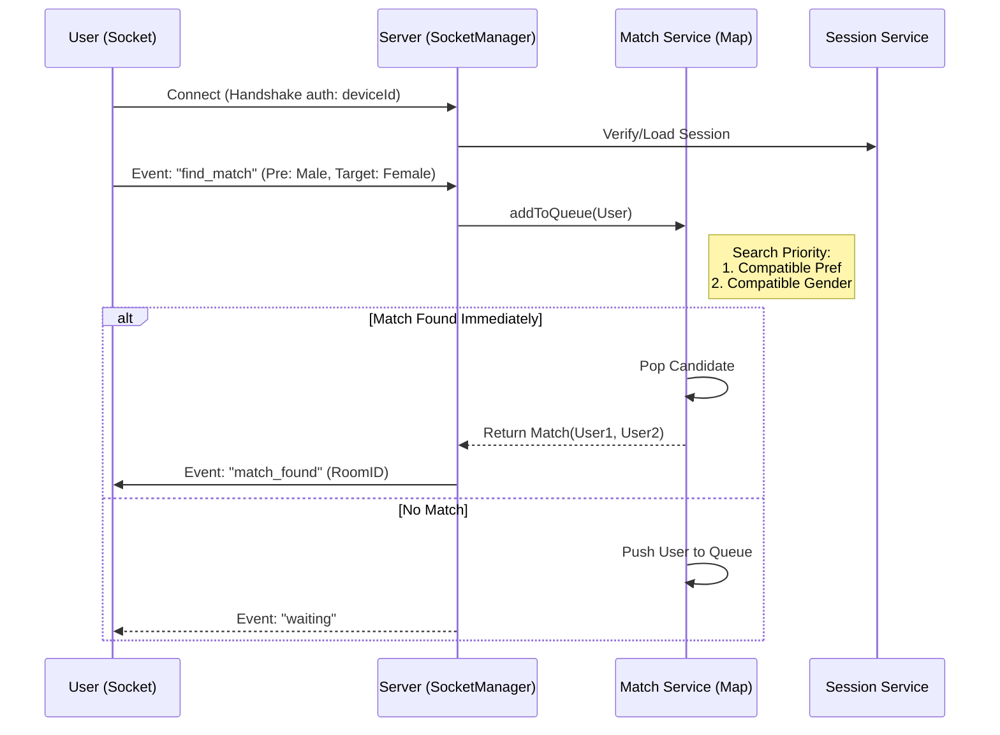
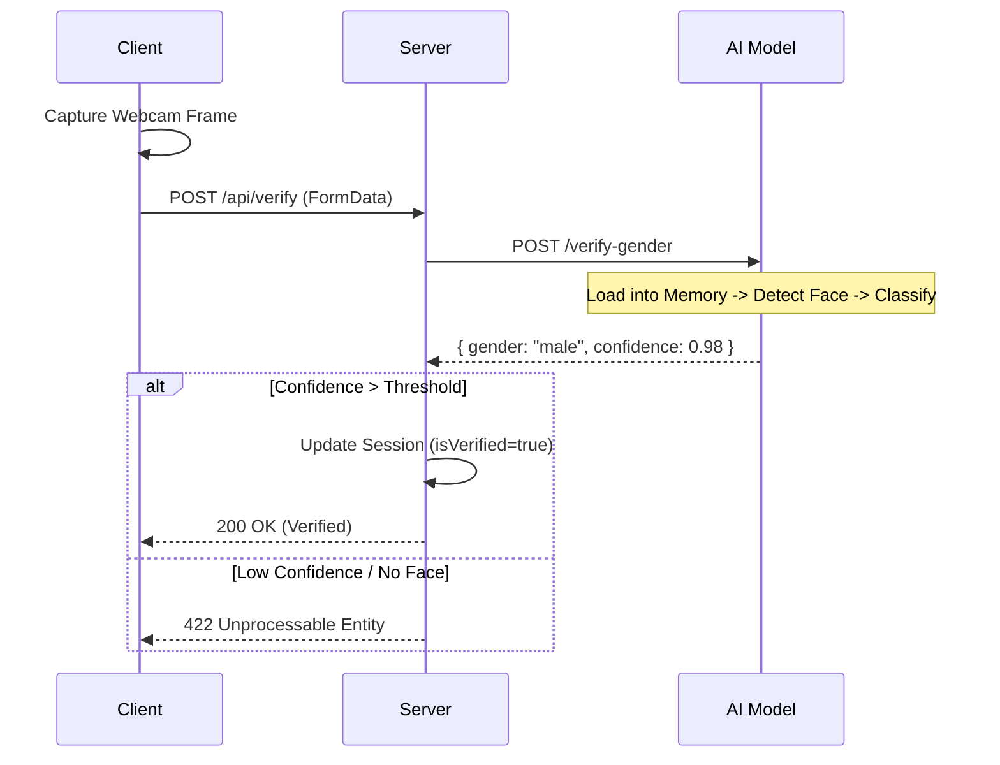
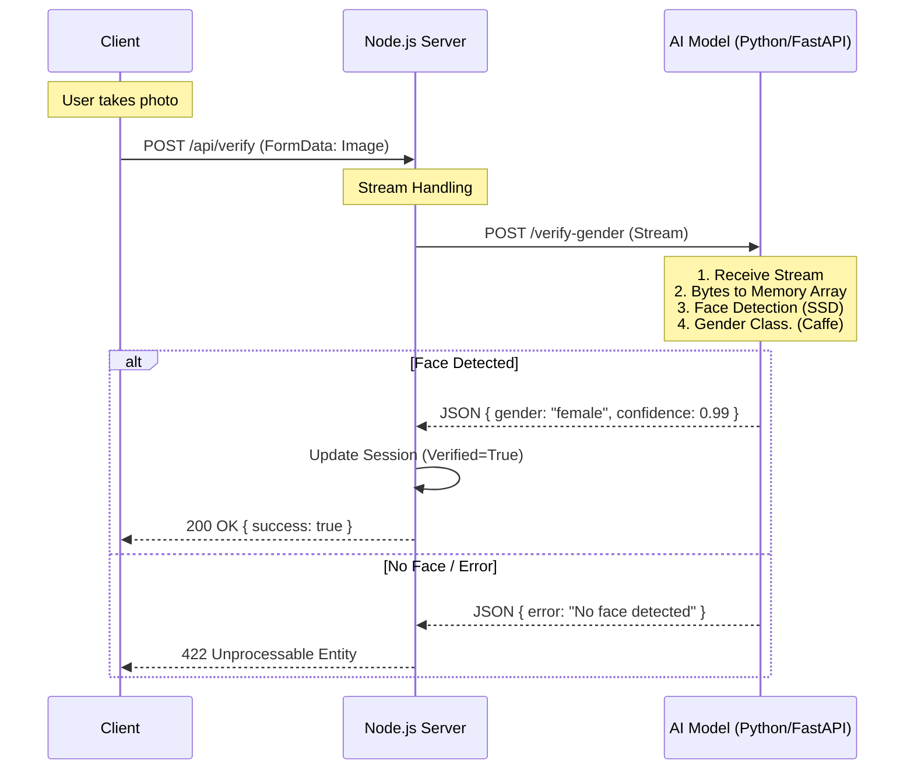

# Ghosty - Application Documentation

This document provides a detailed technical overview of the Ghosty application, its architecture, security mechanisms, and operational flows.

## 1. System Architecture

Ghosty follows a microservices-inspired architecture derived by local services, ensuring easy scalability and development.

### Services Breakdown

- **Client (`/client`)**: A React SPA (Single Page Application) built with Vite and TailwindCSS. It handles the UI, webcam access, and Socket.IO client connections.
- **Server (`/server`)**: The core backend built with Node.js and Express. It manages:
  - **Socket.IO**: Real-time signaling for chat and matchmaking.
  - **Matchmaking Engine**: In-memory queuing system.
  - **Session Management**: Device fingerprinting and persistence via MongoDB.
- **AI Service (`/ai-model`)**: A FastAPI Python service running a Caffe Deep Learning model (OpenCV DNN) for:
  - Face Detection (SSD Framework)
  - Gender Classification
- **Shared (`/shared`)**: Contains TypeScript interfaces and contract types shared between the Client and Server to ensure type safety across the network boundary.

---

## 2. Security & Privacy Features

We prioritized user privacy and anonymity in the architectural design.

### Delete-After-Verify Logic

One of the critical promises of Ghosty is that **no user images are stored**. This is enforced architecturaly, not just by policy.

**How it works:**

1.  **Capture**: User takes a snapshot in the browser.
2.  **Transmission**: The image blob is sent to the Node.js backend.
3.  **Forwarding**: The backend immediately streams this blob to the AI Service (Python).
4.  **Processing**:
    - The AI Service reads the request stream directly into a memory buffer (`bytes`).
    - Using `numpy` and `cv2.imdecode`, the raw bytes are converted to an image array in RAM.
    - The Neural Network processes this array to detect faces and classify gender.
5.  **Destruction**: Once the prediction JSON response is returned, the memory scope in the Python function ends. The Python Garbage Collector automatically frees the RAM blocks containing the image data.
6.  **Zero-Disk Policy**: At no point in this chain is `cv2.imwrite()` or `file.save()` called. The image never touches the hard drive.

### Device ID & Anonymous Sessions

To maintain queues and prevent abuse without requiring email/password, we use a **Device ID** system.

**Implementation:**

- **Generation**: A UUID is generated on the client-side (`localStorage`) upon first visit.
- **Persistence**: This ID acts as the "primary key" for the user's session.
- **Upsert Logic (MongoDB)**:
  ```typescript
  // server/src/services/session.service.ts
  UserSession.findOneAndUpdate(
      { deviceId },
      { $setOnInsert: { deviceId, ... } },
      { upsert: true, new: true }
  );
  ```
- **Benefit**: This allows a user to refresh the page and reconnect to their existing session/queue spot, while seemingly remaining "anonymous" (no PII collected).

### Reporting & Abuse Prevention

To maintain a safe environment, Ghosty implements a reporting system and validation checks:

- **Reporting**: Users can report their chat partner via the UI.
  - **Mechanism**: A `report-user` socket event is sent with a reason and description.
  - **Action**: The server logs the report (persisted in MongoDB), immediately disconnects both users from the room, and notifies the reporter of the action.
- **Validation**: Reports are only accepted from users in an active match with the target.
- **DDoS Protection**: Application-level rate limiting (via `express-rate-limit`) prevents API abuse.

---

## 3. Operational Workflows

### Architecture Diagram: Queuing & Socket Flow

The matchmaking flow determines how users are paired. It uses in-memory Maps for speed (`O(1)` access).



### Real-time Chat Flow (Socket.IO + E2EE)

Once matched, clients exchange messages directly via the server, which acts as a relay for encrypted packets.

```mermaid
sequenceDiagram
    participant A as User A
    participant S as Server
    participant B as User B

    Note over A, B: Start of encrypted session

    A->>S: Event: "join-room" (RoomID)
    B->>S: Event: "join-room" (RoomID)

    rect rgb(20, 20, 20)
        Note left of A: ECDH Key Generation
        A->>S: Event: "exchange-key" (PublicKey A)
        S->>B: Emit: "exchange-key" (PublicKey A)

        Note right of B: ECDH Key Generation
        B->>S: Event: "exchange-key" (PublicKey B)
        S->>A: Emit: "exchange-key" (PublicKey B)

        Note over A, B: Derivive Shared Secret (AES-GCM)
    end

    A->>A: Encrypt Message (IV + Ciphertext)
    A->>S: Event: "send-message" { msg: Cipher, iv: IV }
    S->>B: Emit: "receive-message" { msg: Cipher, iv: IV }
    B->>B: Decrypt Message

    opt Typing Indicators
        B->>S: Event: "typing" (true)
        S->>A: Emit: "partner-typing" (true)
    end
```



### Verification Flow



## 4. Additional Features

### End-to-End Encryption (Implemented)

The application implements full Client-side End-to-End Encryption (E2EE) data privacy.

**Implementation:**

- **Key Exchange**: Uses **ECDH (Elliptic-Curve Diffie-Hellman)**. When two users match, they exchange public keys via the socket server.
- **Secret Derivation**: A shared secret is derived in the browser.
- **Message Encryption**: Chats are encrypted using **AES-GCM** with the derived secret.
- **Security Check**: The server transfers the envelopes but **cannot decrypt** the messages as it never possesses the private keys.

### DDoS Protection & Rate Limiting

To ensure stability and availability, the system implements application-level Rate Limiting.

**Implementation:**

- Uses `express-rate-limit` middleware.
- Limits the number of requests a single IP can make within a time window (e.g., 100 requests per 15 mins).
- Protects API routes (`/api/*`) from abuse and brute-force attacks.

### Known Limitations

While the system enforces privacy and verification, there are known limitations in the current implementation:

- **Virtual Camera / Spoofing**: The current verification system uses a static image analysis. It does not actively detect liveness or depth. Therefore, it is possible for sophisticated users to bypass the gender check using virtual camera software (e.g., OBS) or by presenting a high-quality photo/video to the webcam. This was a design choice to maximize device compatibility and minimize user friction during the MVP phase. Future iterations may include active liveness challenges (e.g., "turn head left") to mitigate this.

- **Device ID Spoofing**: The system relies on a client-generated Device ID stored in `localStorage` for session persistence. Since this ID is not signed or encrypted by the server, it is possible for malicious users to manually modify their local storage to assume the identity of another user if they can obtain that user's UUID. A more secure approach using server-only Signed Cookies is planned for future releases.

### Full System Communication (Client - Server - AI)

The following diagram illustrates the complete interaction loop between the Client, the Node.js Server, and the Python AI Model during the verification phase.



### Horizontal Scaling (Future Proofing)

The code was designed with scaling in mind (originally using Redis Adapters). While currently running in a single-node "In-Memory" mode for simpler EC2 deployment, the codebase contains the structures (Queue Interfaces, Pub/Sub patterns) to easily switch back to Redis for multi-server scaling.

### Robust Error Handling

- **Graceful Degraded State**: If the AI Verification service goes down, the rest of the application (Chat, "Unverified" matchmaking) continues to function.
- **Reconnection Logic**: The frontend handles network dips automatically, re-establishing socket connections without losing the session state.

---
