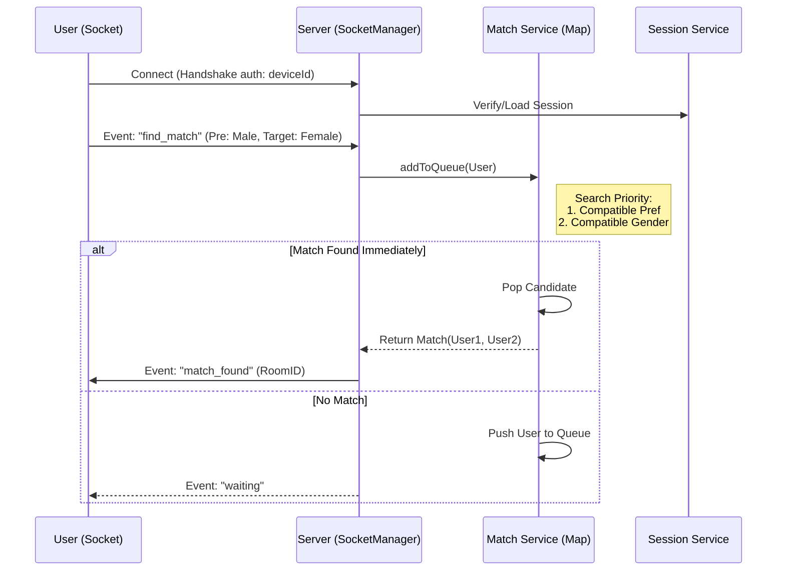
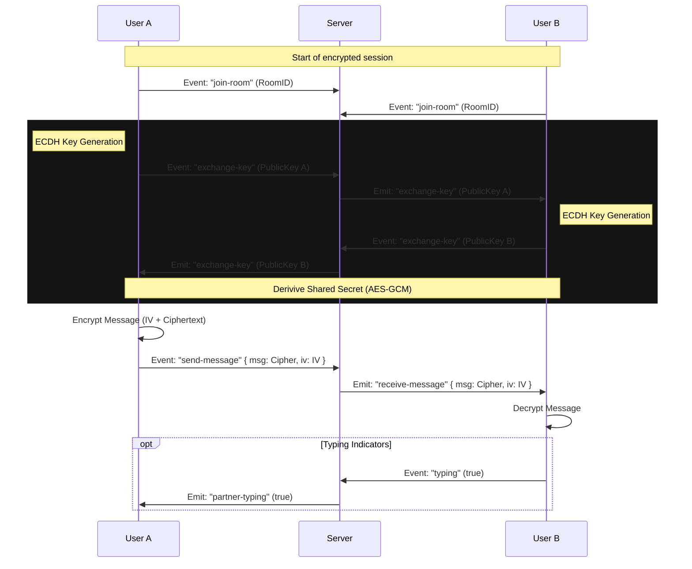
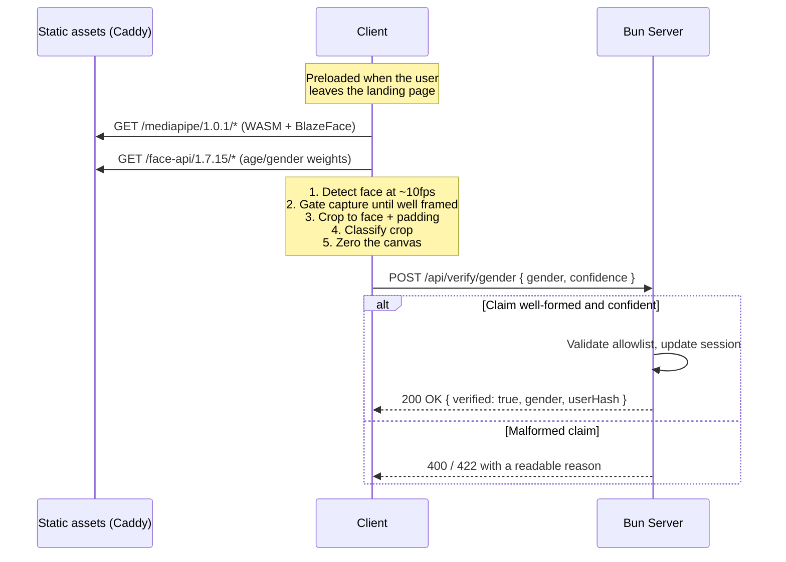

# Ghosty - Application Documentation

This document provides a detailed technical overview of the Ghosty application, its architecture, security mechanisms, and operational flows.

## 1. System Architecture

Ghosty follows a microservices-inspired architecture derived by local services, ensuring easy scalability and development.

### Services Breakdown

- **Client (`/client`)**: A React SPA (Single Page Application) built with Vite and TailwindCSS. It handles the UI, webcam access, and Socket.IO client connections.
- **Server (`/server`)**: The core backend built with Node.js and Express. It manages:
  - **Socket.IO**: Real-time signaling for chat and matchmaking.
  - **Matchmaking Engine**: In-memory queuing system.
  - **Session Management**: Device fingerprinting and persistence via MongoDB.
- **On-device ML (in `/client`)**: There is no ML service. Both models run in the user's browser:
  - **Face detection**: MediaPipe Tasks Vision (BlazeFace, WASM), used to gate the capture button until the user is well framed.
  - **Gender classification**: `@vladmandic/face-api`'s age/gender net, run on the cropped face.
  - Both are served from this origin out of `client/public/`, so no third party is contacted during verification.
- **Shared (`/shared`)**: Contains TypeScript interfaces and contract types shared between the Client and Server to ensure type safety across the network boundary.

---

## 2. Security & Privacy Features

We prioritized user privacy and anonymity in the architectural design.

### The image never leaves the device

Ghostly's promise is that **no user images are stored**. That is now true by construction rather than by discipline: the image is never transmitted at all.

**How it works:**

1.  **Capture**: The user takes a snapshot in the browser. MediaPipe has already located the face, so the frame is cropped to it.
2.  **Classification**: `face-api`'s age/gender net runs on that crop, in the browser, on the user's own CPU.
3.  **Destruction**: The canvas holding the frame is zeroed immediately after the single call that reads it (`client/src/components/Verify.tsx`).
4.  **Transmission**: Only `{ gender, confidence }` is POSTed to `/api/verify/gender`. No image bytes cross the network.
5.  **Zero-Disk Policy**: There is no upload endpoint, no multipart parser and no image buffer on the server. `multer` was removed along with the AI service.

Verify this yourself: open the Network tab during capture and confirm the request body is JSON.

### Trust model: verification is a claim, not a proof

This is the trade-off that pays for the above, and it is deliberate.

Because classification happens on the client, **the server records what it is told**. A modified client can send any allowed value:

```
POST /api/verify/gender  {"gender": "female", "confidence": 0.99}   -> 200 OK
```

`server/src/services/verify.service.ts` validates the *shape* of that claim — an allowlist of `male` / `female`, and a confidence within `[0, 1]` — because it is untrusted input on its way into `session.gender`, which the matchmaking socket reads. It cannot validate the *truth* of it.

`MIN_VERIFY_CONFIDENCE` still applies, but it is advisory: it stops an honest client's genuinely uncertain prediction from granting verified status, and stops nothing else.

**What this buys and what it does not.** It keeps honest users out of the wrong queue and removes an entire service, a language and an image-upload path from the attack surface. It is not a defence against a determined user, and there is no liveness check. If verification ever needs to resist attackers rather than deter casual misuse, classification has to move back behind the server — and the server would need its own face detector, because the gender net returns a confident answer for any input at all (measured on the previous model: random noise classified as female at 0.9985).

### Device ID & Anonymous Sessions

To maintain queues and prevent abuse without requiring email/password, we use a **Device ID** system.

**Implementation:**

- **Generation**: A UUID is generated on the client-side (`localStorage`) upon first visit.
- **Persistence**: This ID acts as the "primary key" for the user's session.
- **Upsert Logic (MongoDB)**:
  ```typescript
  // server/src/services/session.service.ts
  UserSession.findOneAndUpdate(
      { deviceId },
      { $setOnInsert: { deviceId, ... } },
      { upsert: true, new: true }
  );
  ```
- **Benefit**: This allows a user to refresh the page and reconnect to their existing session/queue spot, while seemingly remaining "anonymous" (no PII collected).

### Reporting & Abuse Prevention

To maintain a safe environment, Ghosty implements a reporting system and validation checks:

- **Reporting**: Users can report their chat partner via the UI.
  - **Mechanism**: A `report-user` socket event is sent with a reason and description.
  - **Action**: The server logs the report (persisted in MongoDB), immediately disconnects both users from the room, and notifies the reporter of the action.
- **Validation**: Reports are only accepted from users in an active match with the target.
- **DDoS Protection**: Application-level rate limiting (via `express-rate-limit`) prevents API abuse.

---

## 3. Operational Workflows

### Architecture Diagram: Queuing & Socket Flow

The matchmaking flow determines how users are paired. It uses in-memory Maps for speed (`O(1)` access).


```mermaid
sequenceDiagram
    participant U as User (Socket)
    participant S as Server (SocketManager)
    participant Q as Match Service (Map)
    participant R as Session Service

    U->>S: Connect (Handshake auth: deviceId)
    S->>R: Verify/Load Session

    U->>S: Event: "find_match" (Pre: Male, Target: Female)
    S->>Q: addToQueue(User)

    Note right of Q: Search Priority: <br/>1. Compatible Pref<br/>2. Compatible Gender

    alt Match Found Immediately
        Q->>Q: Pop Candidate
        Q-->>S: Return Match(User1, User2)
        S->>U: Event: "match_found" (RoomID)
    else No Match
        Q->>Q: Push User to Queue
        S-->>U: Event: "waiting"
    end
```

### Real-time Chat Flow (Socket.IO + E2EE)

Once matched, clients exchange messages directly via the server, which acts as a relay for encrypted packets.


```mermaid
sequenceDiagram
    participant A as User A
    participant S as Server
    participant B as User B

    Note over A, B: Start of encrypted session

    A->>S: Event: "join-room" (RoomID)
    B->>S: Event: "join-room" (RoomID)

    rect rgb(20, 20, 20)
        Note left of A: ECDH Key Generation
        A->>S: Event: "exchange-key" (PublicKey A)
        S->>B: Emit: "exchange-key" (PublicKey A)

        Note right of B: ECDH Key Generation
        B->>S: Event: "exchange-key" (PublicKey B)
        S->>A: Emit: "exchange-key" (PublicKey B)

        Note over A, B: Derivive Shared Secret (AES-GCM)
    end

    A->>A: Encrypt Message (IV + Ciphertext)
    A->>S: Event: "send-message" { msg: Cipher, iv: IV }
    S->>B: Emit: "receive-message" { msg: Cipher, iv: IV }
    B->>B: Decrypt Message

    opt Typing Indicators
        B->>S: Event: "typing" (true)
        S->>A: Emit: "partner-typing" (true)
    end
```

### Verification Flow

```mermaid
sequenceDiagram
    participant C as Client (browser)
    participant S as Server

    Note over C: MediaPipe gates capture<br/>until a face is well framed
    C->>C: Capture frame, crop to face
    C->>C: face-api classifies the crop
    C->>C: Zero the canvas

    C->>S: POST /api/verify/gender<br/>{ gender, confidence } - JSON only

    alt Shape valid and confidence >= threshold
        S->>S: Update Session (isVerified=true)
        S-->>C: 200 OK (Verified)
    else Gender not in allowlist
        S-->>C: 400 Bad Request
    else Confidence below threshold
        S-->>C: 422 Unprocessable Entity
    end

    Note over C,S: The image never crosses this boundary.<br/>The server records the claim; it cannot verify it.
```

## 4. Additional Features

### End-to-End Encryption (Implemented)

The application implements full Client-side End-to-End Encryption (E2EE) data privacy.

**Implementation:**

- **Key Exchange**: Uses **ECDH (Elliptic-Curve Diffie-Hellman)**. When two users match, they exchange public keys via the socket server.
- **Secret Derivation**: A shared secret is derived in the browser.
- **Message Encryption**: Chats are encrypted using **AES-GCM** with the derived secret.
- **Security Check**: The server transfers the envelopes but **cannot decrypt** the messages as it never possesses the private keys.

### DDoS Protection & Rate Limiting

To ensure stability and availability, the system implements application-level Rate Limiting.

**Implementation:**

- Uses `express-rate-limit` middleware.
- Limits the number of requests a single IP can make within a time window (e.g., 100 requests per 15 mins).
- Protects API routes (`/api/*`) from abuse and brute-force attacks.

### Known Limitations

While the system enforces privacy and verification, there are known limitations in the current implementation:

- **Virtual Camera / Spoofing**: The current verification system uses a static image analysis. It does not actively detect liveness or depth. Therefore, it is possible for sophisticated users to bypass the gender check using virtual camera software (e.g., OBS) or by presenting a high-quality photo/video to the webcam. This was a design choice to maximize device compatibility and minimize user friction during the MVP phase. Future iterations may include active liveness challenges (e.g., "turn head left") to mitigate this.

- **Device ID Spoofing**: The system relies on a client-generated Device ID stored in `localStorage` for session persistence. Since this ID is not signed or encrypted by the server, it is possible for malicious users to manually modify their local storage to assume the identity of another user if they can obtain that user's UUID. A more secure approach using server-only Signed Cookies is planned for future releases.

### Full System Communication (Client - Server)

Where the work happens during verification. Both models are downloaded once from
this origin and run entirely on the user's machine.


```mermaid
sequenceDiagram
    participant Assets as Static assets (Caddy)
    participant Client
    participant Server as Bun Server

    Note over Client: Preloaded when the user<br/>leaves the landing page
    Client->>Assets: GET /mediapipe/1.0.1/* (WASM + BlazeFace)
    Client->>Assets: GET /face-api/1.7.15/* (age/gender weights)

    Note over Client: 1. Detect face at ~10fps<br/>2. Gate capture until well framed<br/>3. Crop to face + padding<br/>4. Classify crop<br/>5. Zero the canvas

    Client->>Server: POST /api/verify/gender { gender, confidence }

    alt Claim well-formed and confident
        Server->>Server: Validate allowlist, update session
        Server-->>Client: 200 OK { verified: true, gender, userHash }
    else Malformed claim
        Server-->>Client: 400 / 422 with a readable reason
    end
```

### Performance Optimizations (Recent Additions)

To further improve user experience and deployment speed, the architecture has been enhanced with several optimizations:

- **Frontend Code Splitting**: The React application uses `React.lazy()` and `Suspense` to lazily load heavyweight components (like the Chat screen and Video Verification interface). This significantly reduces the size of the initial JavaScript bundle, improving Time to Interactive (TTI).
- **Nginx Response Compression**: The client side is served by Nginx, which is configured to use Gzip compression on static assets (`.js`, `.css`, `.html`). This minimizes bandwidth usage and speeds up load times globally.
- **Optimized Docker Builds**: The `Dockerfile`s use multistage builds and efficient dependency installation commands (`bun install --frozen-lockfile` and caching steps) to reduce final image bloat and accelerate CI/CD workflows.
- **One fewer service**: Verification used to run in a separate Python/OpenCV container (~598MB) that forced 4GB of swap on the deployment VM. Moving both models into the browser removed that container, its image, its CI build and the swap along with it.

### Horizontal Scaling (Future Proofing)

The code was designed with scaling in mind (originally using Redis Adapters). While currently running in a single-node "In-Memory" mode for simpler EC2 deployment, the codebase contains the structures (Queue Interfaces, Pub/Sub patterns) to easily switch back to Redis for multi-server scaling.

### Robust Error Handling

- **Graceful Degraded State**: If either on-device model fails to load, the capture button stays enabled and the user can still attempt verification -- the framing gate fails open rather than locking anyone out. Note that verification itself is not optional: `match.socket.ts` refuses to queue a session without `isVerified` and a gender.
- **Reconnection Logic**: The frontend handles network dips automatically, re-establishing socket connections without losing the session state.
