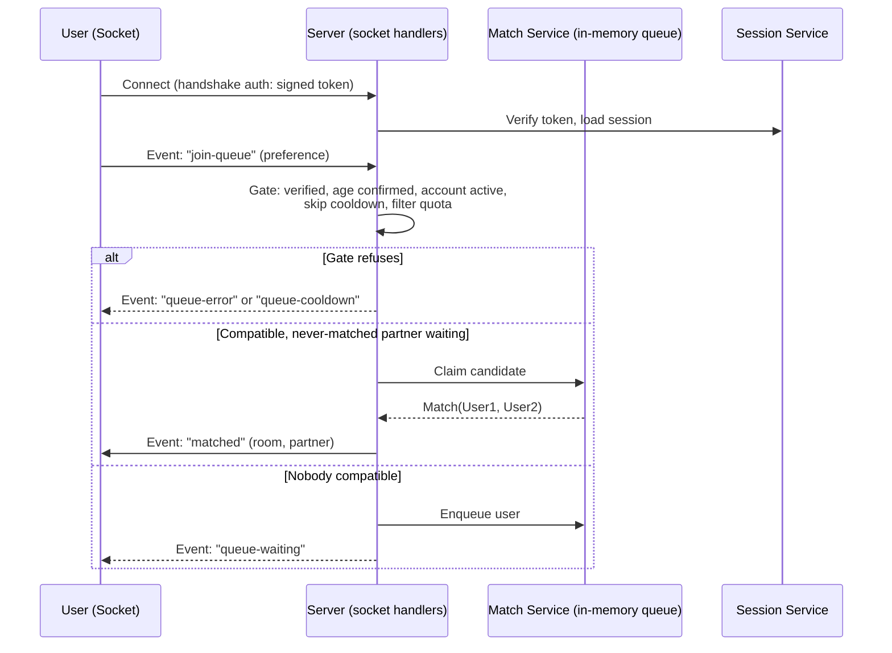
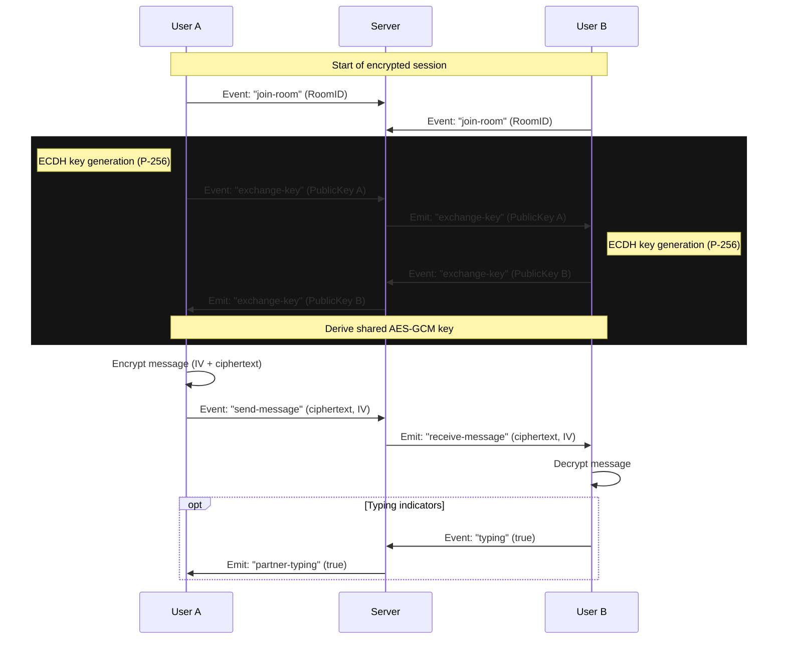
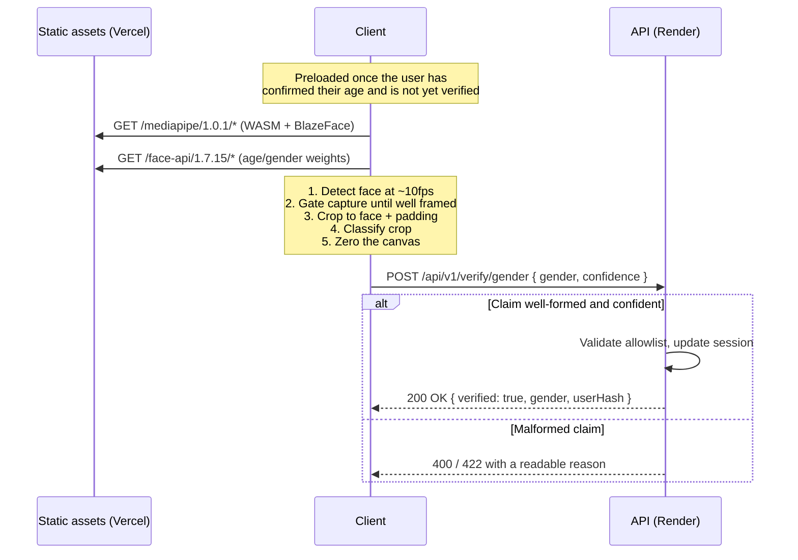

# Ghostly - Application Documentation

This document provides a detailed technical overview of the Ghostly application, its architecture, security mechanisms, and operational flows. Setup, testing and deployment are covered in the [README](README.md).

## 1. System Architecture

Ghostly is two deployments backed by two managed datastores:

| Piece | Where | Role |
| --- | --- | --- |
| Client (`/client`) | Vercel | React SPA: UI, webcam access, on-device ML, encryption, Socket.IO client |
| Server (`/server`) | Render | Bun + Express + Socket.IO: sessions, matchmaking, message relay, reports, admin API |
| MongoDB | Atlas | Sessions, reports, admin audit log |
| Redis | Upstash | Filter quota, rate-limit counters, `lastActive` throttle |

### Services Breakdown

- **Client (`/client`)**: A React SPA built with Vite and TailwindCSS. It handles the UI, webcam access, key generation and encryption, and the Socket.IO connection.
- **Server (`/server`)**: Bun running Express 5 and Socket.IO. It manages:
  - **Sessions**: anonymous, server-issued, signed credentials persisted in MongoDB.
  - **Matchmaking**: an in-memory queue bucketed by gender and preference.
  - **Chat relay**: forwards public keys and ciphertext between matched users.
  - **Moderation**: reports, automatic limiting, and a bearer-token admin API.
- **On-device ML (in `/client`)**: There is no ML service. Both models run in the user's browser:
  - **Face detection**: MediaPipe Tasks Vision (BlazeFace, WASM), used to gate the capture button until the user is well framed.
  - **Gender classification**: `@vladmandic/face-api`'s age/gender net, run on the cropped face.
  - Both are served from this origin out of `client/public/`, so no third party is contacted during verification.

### Single instance by design

The server runs as **one process**. The queue, presence, session cache and skip cooldowns are in-process Maps, and Socket.IO uses its default in-process adapter. This removes a persistent Redis connection and the pub/sub traffic Upstash bills per command, and ordinary chat traffic costs no Redis commands at all.

The cost is that **it must not be scaled out** as-is: on a second instance, two matched users on different processes would never share a room, and nothing would error. The interfaces in `queue.store.ts`, `presence.store.ts` and `match.service.ts` are kept so Redis-backed implementations — plus the Socket.IO Redis adapter — can return if the deployment ever needs more than one instance.

---

## 2. Security & Privacy Features

We prioritized user privacy and anonymity in the architectural design.

### The image never leaves the device

Ghostly's promise is that **no user images are stored**. That is true by construction rather than by discipline: the image is never transmitted at all.

**How it works:**

1.  **Capture**: The user takes a snapshot in the browser. MediaPipe has already located the face, so the frame is cropped to it.
2.  **Classification**: `face-api`'s age/gender net runs on that crop, in the browser, on the user's own CPU.
3.  **Destruction**: The canvas holding the frame is zeroed immediately after the single call that reads it (`client/src/components/Verify.tsx`).
4.  **Transmission**: Only `{ gender, confidence }` is POSTed to `/api/v1/verify/gender`. No image bytes cross the network.
5.  **Zero-Disk Policy**: There is no upload endpoint, no multipart parser and no image buffer on the server.

Verify this yourself: open the Network tab during capture and confirm the request body is JSON.

### Trust model: verification is a claim, not a proof

This is the trade-off that pays for the above, and it is deliberate.

Because classification happens on the client, **the server records what it is told**. A modified client can send any allowed value:

```
POST /api/v1/verify/gender  {"gender": "female", "confidence": 0.99}   -> 200 OK
```

`server/src/services/verify.service.ts` validates the *shape* of that claim — an allowlist of `male` / `female`, and a confidence within `[0, 1]` — because it is untrusted input on its way into `session.gender`, which the matchmaking socket reads. It cannot validate the *truth* of it.

`MIN_VERIFY_CONFIDENCE` still applies, but it is advisory: it stops an honest client's genuinely uncertain prediction from granting verified status, and stops nothing else.

**What this buys and what it does not.** It keeps honest users out of the wrong queue and removes an entire service, a language and an image-upload path from the attack surface. It is not a defence against a determined user, and there is no liveness check. If verification ever needs to resist attackers rather than deter casual misuse, classification has to move back behind the server — and the server would need its own face detector, because the gender net returns a confident answer for any input at all (measured on the previous model: random noise classified as female at 0.9985).

### Anonymous sessions and signed tokens

Ghostly has no accounts, but it still needs a stable identity to hold a verified status, a match history and a report record. It uses **server-issued, signed session tokens**.

**Implementation:**

- **Creation**: `POST /api/v1/session/init` creates a `UserSession` with a server-generated `deviceId` (`crypto.randomUUID()`). The client never chooses its own identity.
- **Credential**: The server returns a token of the form `v1.<payload>.<signature>`, where the payload holds the `deviceId`, an `issuedAt` timestamp and a `version`, and the signature is HMAC-SHA256 over it with `SESSION_SECRET` (`server/src/utils/token.ts`). A raw `deviceId` is never accepted as a credential.
- **Transport**: The client keeps the token in `localStorage` (`client/src/utils/auth.ts`) and sends it as `Authorization: Bearer …` on HTTP and as `auth.token` in the Socket.IO handshake.
- **Expiry**: A token is valid for at most 30 days from issue, regardless of activity. The session document itself expires 30 days after last activity — or after only **6 hours** if it never verifies, so minting junk sessions cannot fill the database.
- **Revocation**: `POST /api/v1/session/logout` bumps the session's `tokenVersion`, which invalidates that session's outstanding tokens and nobody else's. Rotating `SESSION_SECRET` signs out every user at once, so it is a last resort.
- **No PII**: Sessions carry a nickname, a gender claim, a match preference and a date of birth — no name, email or image.

### Age gate

Before matching, users declare a date of birth via `POST /api/v1/session/age` and must be **18 or over**. A refused declaration is not recorded, so the account is not left half-gated. This is a self-declaration — a statement of terms that gives the report flow something to act on — not identity verification.

### Reporting & Abuse Prevention

- **Reporting**: Users can report their chat partner from the chat screen.
  - **Mechanism**: A `report-user` socket event carries a reason (from a fixed list; anything else becomes `Other`) and an optional description, which is trimmed to 500 characters and XSS-sanitised before it is stored.
  - **Validation**: Reports are only accepted from a user in an active match, and only against that match's partner. The same user cannot be reported twice by the same reporter, and reporters are rate-limited.
  - **Action**: The report is persisted in MongoDB and both users are removed from the room, with their per-conversation encryption keys cleared.
- **Automatic limiting**: Once **3 distinct users** have reported an account, it is set to `limited` and cannot join the queue until reviewed. Reports expire after `REPORT_RETENTION_DAYS` (default 365).
- **Admin API**: `/api/v1/admin/*` lists and resolves reports, sets accounts to `active`, `limited` or `banned`, and reads the audit log. It requires `ADMIN_TOKEN` and returns 503 when that is unset. Every admin action is written to the `AuditLog` collection.

### Rate limiting

| Scope | Limit | Store |
| --- | --- | --- |
| All HTTP routes | 100 requests / 15 minutes per IP | Redis |
| `POST /session/init` | 100 / hour per IP | Redis |
| `POST /verify/gender` | 5 / minute per IP | Redis |
| Socket connections | 60 / minute per client | Redis |
| Socket events | Per-event budgets per socket | In-process |

`/health` is not metered. HTTP limiters **fail open** if Redis errors, so a Redis blip degrades protection rather than taking the API down. A socket that exceeds its event budget is told with a `rate-limited` event; one that keeps doing so is disconnected.

Client IPs are taken from `CF-Connecting-IP`, which cannot be forged behind Render's Cloudflare edge, with an `X-Forwarded-For` fallback governed by `TRUSTED_PROXY_HOPS`.

### Production boot guards

The server refuses to start in production rather than run misconfigured. It exits at boot if `SESSION_SECRET` is the development default or the `.env.example` placeholder, if `CLIENT_URL` is unset or names a local address, if `MONGO_URI` or `REDIS_URL` is missing or points at localhost, or if `MIN_VERIFY_CONFIDENCE` or `REPORT_RETENTION_DAYS` is not a number. Each of these used to fail silently — an open CORS policy, a disabled confidence gate, reports that never expired — or much later with a misleading error.

---

## 3. Operational Workflows

### Matchmaking Flow

The queue is in memory and bucketed by what each user **is** and what they **want**, so a joiner searches only the buckets of people who want them.


```mermaid
sequenceDiagram
    participant U as User (Socket)
    participant S as Server (socket handlers)
    participant Q as Match Service (in-memory queue)
    participant R as Session Service

    U->>S: Connect (handshake auth: signed token)
    S->>R: Verify token, load session

    U->>S: Event: "join-queue" (preference)
    S->>S: Gate: verified, age confirmed, account active,<br/>skip cooldown, filter quota

    alt Gate refuses
        S-->>U: Event: "queue-error" or "queue-cooldown"
    else Compatible, never-matched partner waiting
        S->>Q: Claim candidate
        Q-->>S: Match(User1, User2)
        S->>U: Event: "matched" (room, partner)
    else Nobody compatible
        S->>Q: Enqueue user
        S-->>U: Event: "queue-waiting"
    end
```

Two users who have been matched are never paired again; each session remembers its last 200 partners. A proposed change — allow re-matching, but never with someone you reported — is specified in `docs/superpowers/specs/2026-09-10-rematch-after-conversation-design.md` and not yet implemented.

Skipping a partner (`next-match`) starts a 5-second cooldown. Gender-filtered searches draw on a quota of 5 per rolling 24 hours, held in Redis so it survives a restart; searching for "Any" is free.

### Real-time Chat Flow (Socket.IO + E2EE)

Once matched, clients exchange messages through the server, which acts as a relay for encrypted packets.


```mermaid
sequenceDiagram
    participant A as User A
    participant S as Server
    participant B as User B

    Note over A, B: Start of encrypted session

    A->>S: Event: "join-room" (RoomID)
    B->>S: Event: "join-room" (RoomID)

    rect rgb(20, 20, 20)
        Note left of A: ECDH key generation (P-256)
        A->>S: Event: "exchange-key" (PublicKey A)
        S->>B: Emit: "exchange-key" (PublicKey A)

        Note right of B: ECDH key generation (P-256)
        B->>S: Event: "exchange-key" (PublicKey B)
        S->>A: Emit: "exchange-key" (PublicKey B)

        Note over A, B: Derive shared AES-GCM key
    end

    A->>A: Encrypt message (IV + ciphertext)
    A->>S: Event: "send-message" (ciphertext, IV)
    S->>B: Emit: "receive-message" (ciphertext, IV)
    B->>B: Decrypt message

    opt Typing indicators
        B->>S: Event: "typing" (true)
        S->>A: Emit: "partner-typing" (true)
    end
```

The server only relays a message if the sender is actually in that room. Leaving (`leave-chat`), skipping (`next-match`), reporting or disconnecting tears the room down, emits `partner-disconnected` to the other side, and clears the per-conversation public keys so a stale key never carries over to the next match.

### Verification Flow

```mermaid
sequenceDiagram
    participant C as Client (browser)
    participant S as Server

    Note over C: MediaPipe gates capture<br/>until a face is well framed
    C->>C: Capture frame, crop to face
    C->>C: face-api classifies the crop
    C->>C: Zero the canvas

    C->>S: POST /api/v1/verify/gender<br/>{ gender, confidence } - JSON only

    alt Shape valid and confidence >= threshold
        S->>S: Update session (isVerified=true, 30-day expiry)
        S-->>C: 200 OK { verified: true, ... }
    else Gender not in allowlist
        S-->>C: 400 Bad Request
    else Confidence below threshold
        S-->>C: 422 Unprocessable Entity
    end

    Note over C,S: The image never crosses this boundary.<br/>The server records the claim; it cannot verify it.
```

### Full System Communication (Client - Server)

Where the work happens during verification. Both models are downloaded once from
the SPA's own origin and run entirely on the user's machine.


```mermaid
sequenceDiagram
    participant Assets as Static assets (Vercel)
    participant Client
    participant Server as API (Render)

    Note over Client: Preloaded once the user has<br/>confirmed their age and is not yet verified
    Client->>Assets: GET /mediapipe/1.0.1/* (WASM + BlazeFace)
    Client->>Assets: GET /face-api/1.7.15/* (age/gender weights)

    Note over Client: 1. Detect face at ~10fps<br/>2. Gate capture until well framed<br/>3. Crop to face + padding<br/>4. Classify crop<br/>5. Zero the canvas

    Client->>Server: POST /api/v1/verify/gender { gender, confidence }

    alt Claim well-formed and confident
        Server->>Server: Validate allowlist, update session
        Server-->>Client: 200 OK { verified: true, gender, userHash }
    else Malformed claim
        Server-->>Client: 400 / 422 with a readable reason
    end
```

---

## 4. Additional Features

### End-to-End Encryption

The application implements client-side end-to-end encryption.

**Implementation** (`client/src/utils/crypto.ts`, `client/src/hooks/useChatHook.ts`):

- **Key Exchange**: Uses **ECDH on P-256**. Each conversation generates a fresh key pair, and the public halves are exchanged through the socket server.
- **Secret Derivation**: A shared AES-GCM key is derived in the browser with the Web Crypto API.
- **Message Encryption**: Every message is encrypted with **AES-GCM** under that key, with a fresh IV.
- **What the server sees**: envelopes of ciphertext and IV. It never holds a private key, so it cannot decrypt a message.

### Performance Optimizations

- **Code splitting**: `Verify`, `Chat` and `ProfileSetup` are loaded with `React.lazy()` and `Suspense`, keeping the ML-heavy screens out of the initial bundle.
- **Targeted model preload**: the ~11.7MB of models are fetched only for users heading into verification, not on arrival, and served with a one-year immutable cache.
- **Response compression**: the API uses `compression`; Vercel compresses the static build.
- **No build step on the server**: Bun runs the TypeScript directly, so a Render deploy is `bun install --frozen-lockfile` and start.
- **One fewer service**: Verification used to run in a separate Python/OpenCV container (~598MB) that forced 4GB of swap on the deployment VM. Moving both models into the browser removed that container, its image and its CI build.
- **Cheap on Redis**: moving the queue, presence and session cache in-process means ordinary chat traffic issues no Redis commands, which matters on a per-command-billed free tier.

### Robust Error Handling

- **Graceful degraded state**: If either on-device model fails to load, the capture button stays enabled and the user can still attempt verification — the framing gate fails open rather than locking anyone out. Verification itself is not optional: `match.socket.ts` refuses to queue a session without `isVerified` and a gender.
- **Socket payload safety**: Every socket handler is wrapped in `safeHandler`, and payloads are validated before use, so a malformed event cannot crash the process.
- **Crash handling**: On an uncaught exception the server drains its connections and exits non-zero, so Render restarts it instead of leaving it in an unknown state.
- **Reconnection**: The client reconnects automatically after a network dip, and tells the user when Socket.IO has exhausted its retries instead of failing silently.
- **Error responses**: Stack traces and internal messages are only returned when `NODE_ENV` is explicitly `development` or `test`.

### Known Limitations

- **Verification is spoofable**: Classification runs on the client, so a modified client can claim any gender (see the trust model above). There is also no liveness check, so a virtual camera (e.g. OBS) or a photo held to the webcam will pass even for an unmodified client.
- **Unauthenticated key exchange**: Public keys travel through the server and are not verified out of band, so E2EE protects against network eavesdroppers, not against a malicious server.
- **Tokens in `localStorage`**: A script running on the page could read the session token. The CSP limits scripts to the SPA's own origin, tokens expire after 30 days, and a single session can be revoked without affecting anyone else.
- **Single instance**: The server cannot be scaled horizontally without restoring Redis-backed state (see "Single instance by design").
- **Free-tier cold starts**: Render's free tier spins down after 15 minutes idle and takes about a minute to wake, which makes matching unreliable when traffic is low — the queue needs two people online at once.
